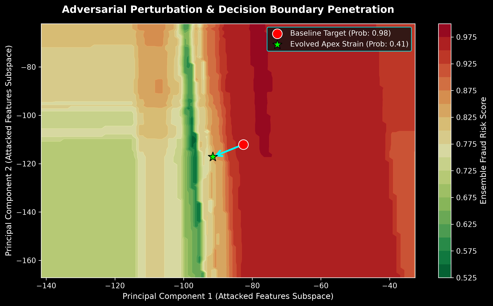

# Red Team Fraud Bypass: Adversarial Machine Learning & Evolutionary Defense Hardening

Most machine learning classification projects conclude once a baseline model achieves satisfactory benchmark metrics. This repository shifts the paradigm to active adversarial defense. By simulating a "Red Team" adversary utilizing Black-Box Boundary Attacks and Evolutionary Genetic Algorithms, we explicitly breed "Super-Fraud" data vectors designed to exploit the non-linear decision boundaries of a state-of-the-art financial fraud detection system. 

My goal was to  close the loop through automated Adversarial Retraining, establishing a self-healing architecture that mathematically patches discovered vulnerabilities.

---

## 1. Phase I: Baseline Models & Soft-Voting Ensemble

To address the severe class imbalance inherent in the IEEE-CIS Fraud Detection dataset, I trained two distinct gradient boosting architectures to establish our defensive baseline.

### XGBoost (Level-wise Growth)
Acts as the conservative foundation of our defense. It optimizes the regularized objective function, minimizing the loss over sequential additive trees:

$$
\mathcal{L}^{(t)} = \sum_{i=1}^{n} l(y_i, \hat{y}_i^{(t-1)} + f_t(x_i)) + \Omega(f_t)
$$

Where $\Omega(f_t) = \gamma T + \frac{1}{2} \lambda ||w||^2$ controls tree complexity to prevent overfitting.

### LightGBM (Leaf-wise Growth)
Provides a high-speed, aggressive counterpart. During initial training, LightGBM's default hyperparameters overfit the minority class, yielding a poor precision of 0.25. By strictly bounding the parameter space (constraining `max_depth` to 8 and reducing `scale_pos_weight`), we drove precision up to 0.38.

### The Soft-Voting Ensemble
To construct a highly complex, non-linear decision boundary that mitigates the blind spots of both models, I merged them into a Soft-Voting Ensemble. The final probability output is the mean of the constituent probability distributions:

$$
P_{ensemble}(y=1|X) = \frac{P_{xgb}(y=1|X) + P_{lgbm}(y=1|X)}{2}
$$

**Ensemble Defense Metrics:**
* ROC-AUC: 0.9571
* Recall (Fraud): 0.81
* Precision (Fraud): 0.40
* F1-Score: 0.54

---

## 2. Phase II: Black-Box Boundary Attacks

With the defensive boundary established, I deployed an automated iterative attack engine. Operating under Black-Box constraints (no access to model gradients or weights), the agent queries the ensemble as an Oracle. 

The attacker isolates a true-positive fraud transaction ($x_{orig}$) and applies uniform perturbations ($\delta$) exclusively to continuous tabular features to maintain semantic structural validity. To test the boundary resilience, I utilized an initial $\epsilon$ radius of 0.15:

$$
x_{adv}^{(feat)} = x_{orig}^{(feat)} \times (1 + \delta) \quad \text{where} \quad \delta \sim \mathcal{U}(-\epsilon, \epsilon)
$$

The engine successfully bypassed the defense on 9 out of 100 highly guarded targets, driving the model's confidence below the standard classification threshold ($P_{ensemble} < 0.5$).

---

## 3. Phase III: Evolutionary "Super-Fraud" Breeding

To escalate the attack sophistication beyond random heuristic perturbations, I engineered a Genetic Algorithm to explicitly "breed" adversarial variants. The algorithm treats transaction features as genetic material, applying evolutionary pressure to systematically map and exploit the model's high-dimensional blind spots.

I expanded the evolutionary pressure by initializing a population size of 100 clones and allowing 100 generations of evolution. 

### The Mathematical Fitness Function
The evolutionary objective is to maximize the model's classification error. Therefore, the fitness of any individual transaction ($x$) is defined as the inverse of the ensemble's fraud probability:

$$
\text{Fitness}(x) = 1.0 - P_{ensemble}(y=1|x)
$$

Through generations of Selection (retaining the top 25% fittest survivors), Crossover (recombining tabular traits from high-fitness parents), and Mutation (injecting localized variance), the population systematically migrates toward the $0.50$ decision boundary.

---

## 4. Phase IV: Adaptive Hyper-Mutation & Boundary Penetration

During standard genetic evolution, the population encountered a local minimum. A prime target, originally detected with $0.9792$ probability, was successfully degraded to $0.6883$ but then stagnated. The population lacked the genetic diversity to cross the decision boundary.

To break this plateau, we implemented a real-time **Adaptive Hyper-Mutation Engine**. The system calculates the gradient of the best fitness score over $k$ epochs. If stagnation is detected ($\Delta \text{Fitness} \approx 0$ for 5 generations), the engine triggers a "Chaos Event" that drastically expands both the mutation probability ($\mu$) and the spatial exploration radius ($R$):

$$
\mu_{new} = \min(\mu_{base} \times 2.5, 0.8)
$$

$$
R_{new} = R_{base} \times 2.6
$$

**The Result:** By dynamically blowing open the mutation rate to 0.75 and the radius to 0.39, the population was forced out of the local trap. Within 3 generations of the chaos trigger, the algorithm discovered a hidden structural vulnerability, dropping the ensemble's confidence to **0.4081**—achieving a complete system bypass.

### Visualizing the Adversarial Vector

*The PCA-projected decision space mapping the trajectory of the genetic attack. The vector demonstrates the hyper-mutation engine forcibly relocating the transaction from a high-confidence region (0.98) across the decision boundary into the false-negative safe zone (0.41).*

---

## 5. Phase V: Adversarial Retraining (The Min-Max Game)

To achieve systemic resilience, the loop must be closed. I isolate the highly optimized "Super-Fraud" strains generated by the genetic algorithms and automatically inject them back into the continuous training data pipeline. 

This mechanism approximates the theoretical Min-Max formulation of adversarial machine learning, where the outer loop minimizes model loss while the inner loop (our Red Team genetic agent) maximizes it:

$$
\min_{\theta} \mathbb{E}_{(x,y)\sim \mathcal{D}} \left[ \max_{||\delta||_\infty \leq \epsilon} L(f_\theta(x+\delta), y) \right]
$$

**Final Vulnerability Mitigation Rate: 100.00%**
Upon retraining, the hardened ensemble successfully intercepted all previously evolved bypass mutations, correctly recalibrating the decision boundaries and driving detection probabilities back into the high-confidence safety thresholds (0.55 - 0.87).

---

## 6. Repository Structure

```text
├── assets/                  # High-resolution boundary visualizations
├── data/                    # Local raw dataset files (Git ignored)
├── models/                  # Serialized pkl components & target data vectors
└── src/
    ├── data_processing.py   # Cleansing, merging & feature formatting
    ├── train_baseline.py    # Baseline model builds and benchmarking
    ├── tune_lightgbm.py     # Hyperparameter optimization routine
    ├── train_ensemble.py    # Soft-voting architecture assembly
    ├── red_team_agent.py    # Iterative Black-Box boundary attack engine
    ├── genetic_attacker.py  # Adaptive evolutionary breeding simulator
    ├── visualize_boundary.py # PCA decision boundary rendering script
    └── adversarial_retraining.py # Vulnerability patch & model hardening
```
---

## 7. Execution Protocol

To replicate the end-to-end active defense simulation:

1. **Clone the Repository:**
   ```bash
   git clone [https://github.com/YOUR_USERNAME/red-team-fraud-bypass.git](https://github.com/biancamzullo/red-team-fraud-bypass.git)
   cd red-team-fraud-bypass
2. **Execute the pipeline sequence:**
    python src/train_ensemble.py          # 1. Compile the baseline defense models
    python src/red_team_agent.py          # 2. Runs the heuristic boundary attack
    python src/genetic_attacker.py        # 3. Runs the adaptive evolutionary simulator
    python src/visualize_boundary.py      # 4. Renders the adversarial topography map
    python src/adversarial_retraining.py  # 5. Patches vulnerabilities and hardens models
